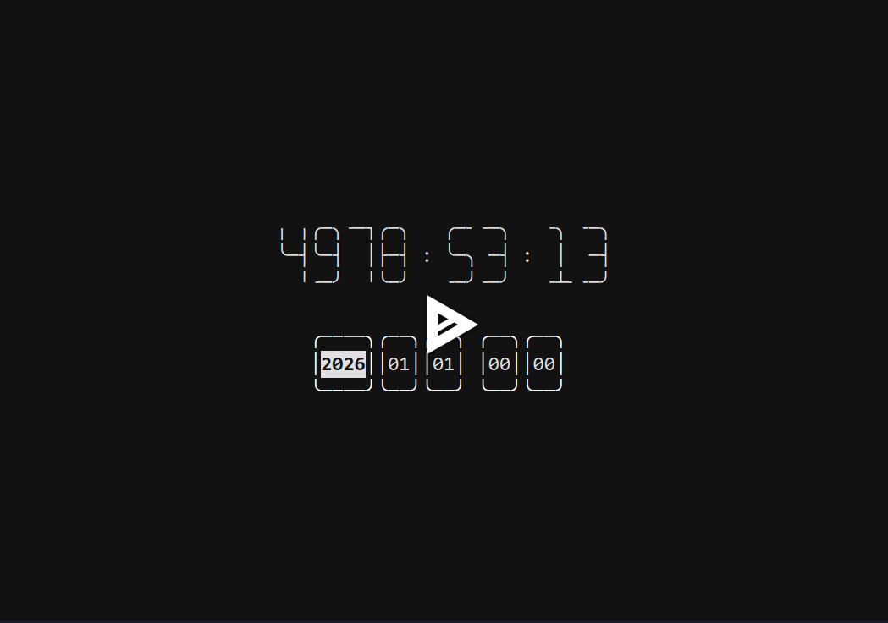

# Countdown

A simple countdown app in terminal.

[](https://asciinema.org/a/722366)

## Run

```bash
uv run main.py
```

## Key bindings

1. Select left: `arrow left`, `a`, `h`.
2. Select right: `arrow right`, `d`, `l`.
2. Increase: `arrow up`, `w`, `k`.
2. Decrease: `arrow down`, `s`, `j`.
